# PortfolioHub

PortfolioHub is a IOS/Android Stock Portfolio/Dividend Tracker mobile app. The app is designed to assist users in visualizing their stock portfolio and the dividend income associated with their portfolio, which will be updated in real-time using various stock market APIs.

## Screenshots

### Intro
<div style="display: flex; justify-content: center; align-items: center; margin-bottom: 25px;">
   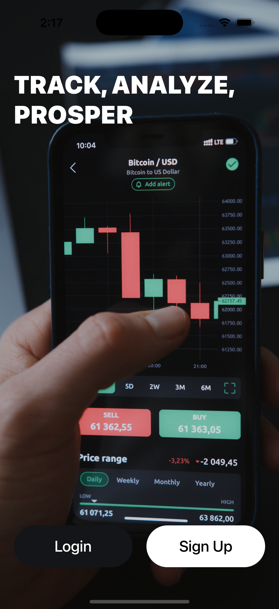
   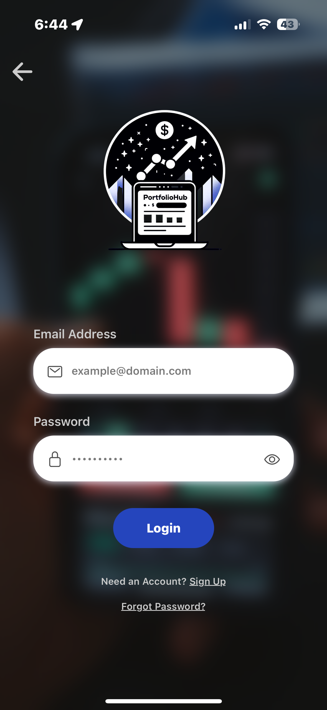
   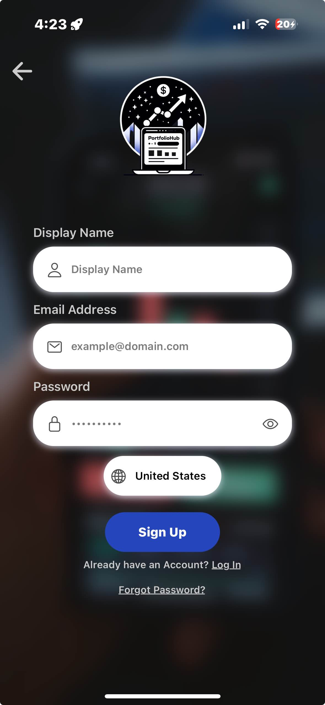
   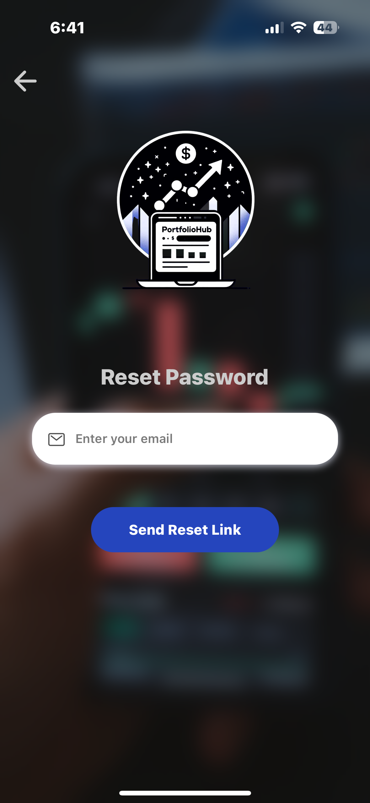
</div>

### Home
<div style="display: flex; justify-content: center; align-items: center; margin-bottom: 25px;">
   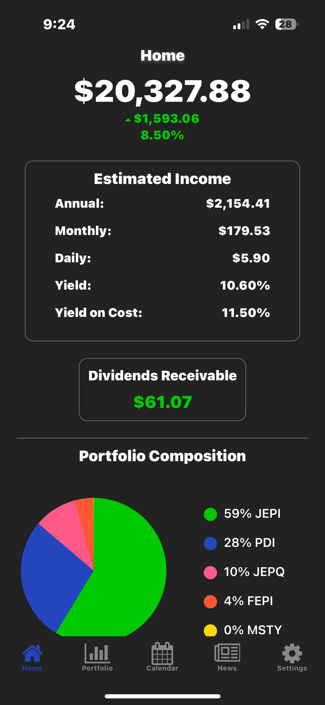
   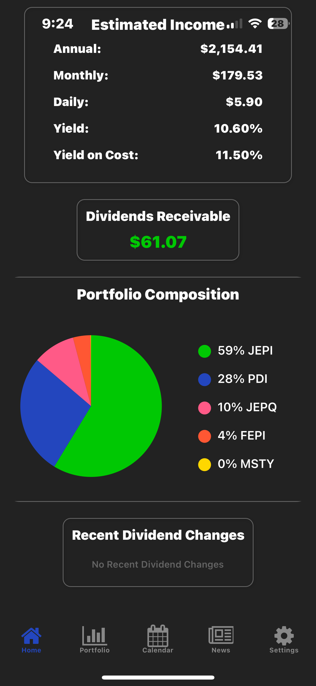
</div>

### Portfolio
<div style="display: flex; justify-content: center; align-items: center; margin-bottom: 25px;">
   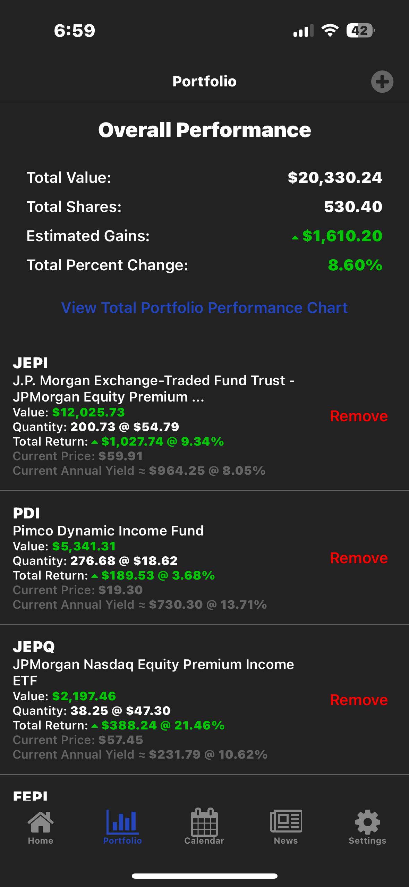
   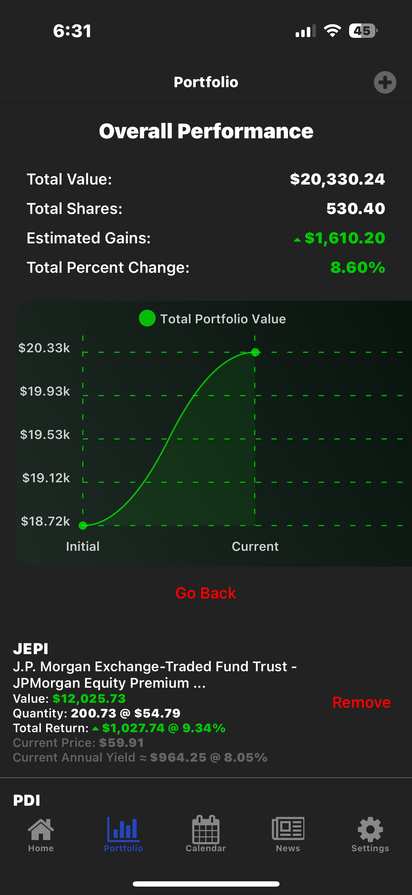
   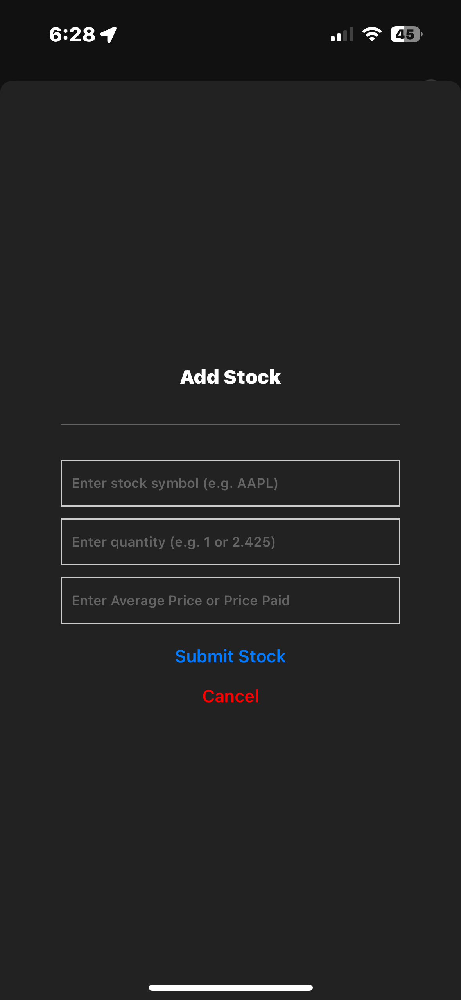
</div>

### Calendar
<div style="display: flex; justify-content: center; align-items: center; margin-bottom: 25px;">
   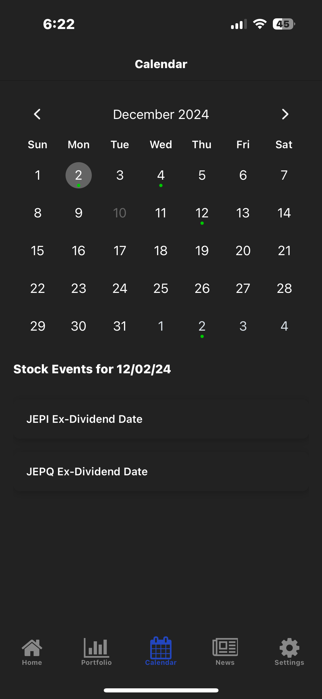
   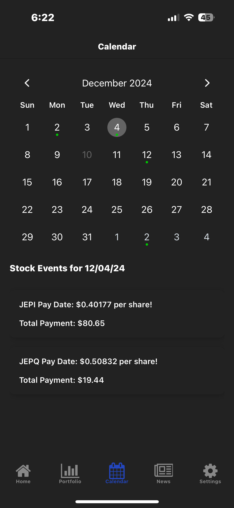
</div>

### News & Settings
<div style="display: flex; justify-content: center; align-items: center; margin-bottom: 25px;">
   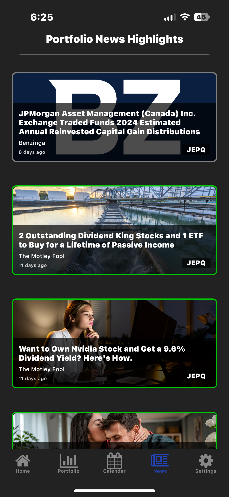
   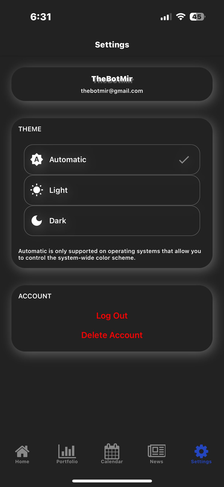
</div>

## Authors

- [Amir Badrudeen](https://github.com/amirb2607)
- [Joel Matlala](https://github.com/JoelMatlala94)

## Get Started
1. Move to PortfolioHub app folder.

   ```bash
   cd PortfolioHub
   ``` 

2. Install dependencies

   ```bash
   npm install
   ```

3. Start the app

   ```bash
   npx expo start
   ```

## Usage

In the output, you'll find options to open the app in a

- [development build](https://docs.expo.dev/develop/development-builds/introduction/)
- [Android emulator](https://docs.expo.dev/workflow/android-studio-emulator/)
- [iOS simulator](https://docs.expo.dev/workflow/ios-simulator/)
- [Expo Go](https://expo.dev/go), a limited sandbox for trying out app development with Expo

## Contributing

TBD

Please make sure to update tests as appropriate.

## License

[GNU GPLv3](./LICENSE)
